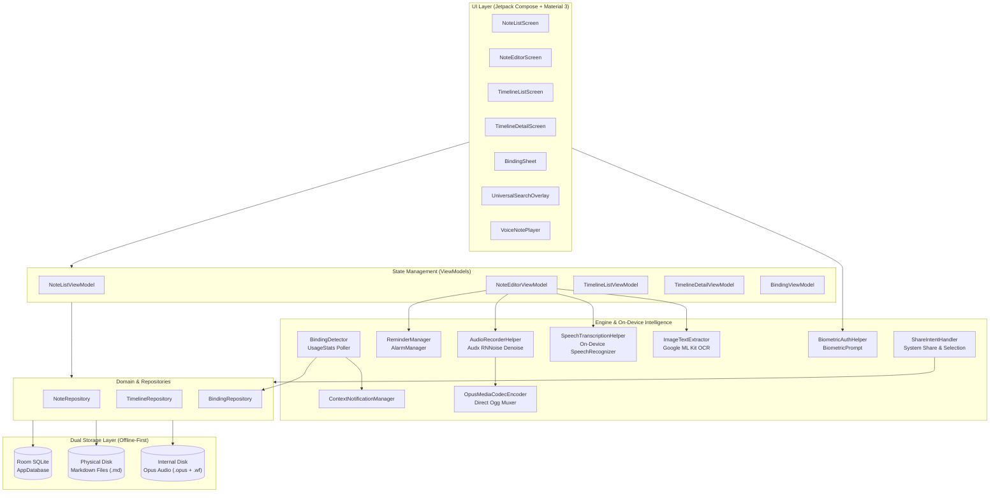

<div align="center">

# 📓 NAUGHTY

### *The Context-Aware, Local-First Markdown Workspace & Timeline Engine for Android.*

[](https://github.com/pritesh-ranjan/Naughty/actions)
[](https://github.com/pritesh-ranjan/Naughty/releases/latest)
[](https://github.com/pritesh-ranjan/Naughty/releases)
[-059669?style=flat-square)](PRIVACY.md)
[](SECURITY.md)
[](LICENSE)

<br/>

> **Most note apps trap your thoughts inside a silo.**  
> **Naughty surfaces them dynamically the exact moment and place you need them.**

<br/>

[Why Naughty?](#-why-naughty) •
[Key Features](#-key-features) •
[Themes & Aesthetics](#-handcrafted-themes--paper-patterns) •
[System Architecture](#-system-architecture) •
[Security & Privacy](#-security--privacy-first) •
[Release Signing](#-release-signing--verification) •
[Installation](#-installation--getting-started) •
[Building from Source](#-building-from-source) •
[Privacy Policy](PRIVACY.md) •
[Security Policy](SECURITY.md)

---

</div>

<br/>

## 💡 Why Naughty?

Have you ever created a shopping list, only to forget checking it when you arrived at the store and opened your grocery app? Or jotted down meeting agenda items that you completely forgot to review when opening Zoom or Slack? Or had a high-stakes life project—like a visa application, passport renewal, or loan approval—scattered across checklists and calendar reminders?

**Naughty is designed around how you actually use your phone.**

1. **Context-Aware Surfacing**: Notes and checklists automatically appear as heads-up cards whenever you open the relevant application.
2. **Timeline Workflow Engine**: Multi-step, high-stakes tasks are tracked with milestones, customizable stages, and audit logs.
3. **Studio-Grade Voice Notes**: Record crystal-clear voice notes with real-time neural noise suppression and interactive waveform scrubbing.
4. **100% Local & Future-Proof**: Every note is stored as a standard physical `.md` (Markdown) file on your device. Zero cloud accounts, zero telemetry, zero internet access.

---

## ⚡ Key Features

```
┌────────────────────────────────────────────────────────────────────────┐
│                          NAUGHTY AT A GLANCE                           │
├────────────────────────────────┬───────────────────────────────────────┤
│ 🧠 Context-Aware App Binding   │ Surface notes when target apps launch │
│ 🗺️ Timeline Tasks Engine       │ Multi-step workflows & audit logs     │
│ 🎙️ Neural Voice Notes          │ Audx AI denoise + direct Opus stream  │
│ 📝 Hybrid Markdown Editor      │ Interactive blocks & raw Markwon      │
│ 📥 Rapid System Share          │ Ingest text, links & images anywhere  │
│ 👁️ Local ML Kit OCR            │ Extract text from images 100% offline │
│ 🔒 Hardware Biometric Vault    │ Fingerprint/face lock with zero leaks │
│ ⏰ Scheduled Exact Alarms      │ Doze-resilient alerts & calendar sync │
│ 🎨 14 Handcrafted Themes       │ Artisan palettes & paper patterns     │
│ 📂 Dual-Storage Architecture   │ Room metadata + physical .md files    │
└────────────────────────────────┴───────────────────────────────────────┘
```

---

### 🧠 1. Context-Aware App Binding
Bind any note or checklist to one or more applications installed on your phone.
* **Smart On-Device Detection**: Battery-friendly background engine monitors foreground app transitions using Android's native `UsageStatsManager`.
* **3 Flexible Trigger Modes**:
  * **Persistent**: Surfaces your note whenever the target application opens.
  * **One-Shot**: Auto-deactivates after the first trigger (ideal for errands and one-time tasks).
  * **Custom Expiry**: Set an exact date and time for the binding to retire automatically.
* **Non-Intrusive Notifications**: High-priority heads-up cards with instant deep-linking. Automatically dismisses when you navigate away from the target app.

---

### 🗺️ 2. Timeline Tasks & Multi-Stage Workflows
An independent workflow and progress engine built for high-stakes, multi-step efforts (e.g. visa applications, home buying, passport renewals, product launches):
* **Structured Milestones**: Organize complex projects into sequential milestones with descriptions and due dates.
* **Flexible Stage System**: 5 standard categories (`Not Started`, `In Progress`, `Blocked`, `Done`, `Cancelled`) plus tracker-specific custom stages.
* **Deterministic Progress Calculation**: Accurately measures progress (`done / (total - cancelled)`), automatically excluding cancelled milestones from the percentage.
* **Visual Stepper & Audit Log**: Interactive stepper interface accompanied by an immutable-style activity log that records state transitions and notes.
* **Milestone Alarms**: Schedule exact alarm notifications for milestone due dates with direct navigation back to the tracker.

---

### 🎙️ 3. Neural Voice Notes & Waveform Player
High-fidelity, on-device audio recording with real-time neural noise reduction and WhatsApp-style playback:
* **Audx Neural Noise Suppression**: Integrated RNNoise neural network model filters background noise, wind, and hum from your recordings on a dedicated audio worker thread.
* **Real-Time Denoise Toggle**: Mid-recording toggle pill (`[✨ AI Denoise: ON/OFF]`) switches seamlessly between neural denoising and raw microphone audio without interrupting the recording.
* **Direct Opus Streaming (Zero Disk Waste)**: Raw cleaned PCM audio is encoded on-the-fly by Android's native `MediaCodec` Opus encoder (`audio/opus`, 48 kHz, 32 kbps) directly into an Ogg container—saving directly as `.opus` with **zero intermediate WAV files**.
* **Instant Waveform Visualization**: Normalized RMS amplitude vectors are saved alongside as `.wf` metadata, allowing instantaneous waveform rendering without pre-decoding audio.
* **Interactive Waveform Player**: Tap or drag to scrub through the waveform, toggle playback speeds (1x, 1.5x, 2x), delete recordings, or attach audio directly into markdown notes.
* **Offline Speech-to-Text Dictation**: Transcribe speech 100% on-device using Android's local `SpeechRecognizer`, with one-tap insertion directly into your note markdown.

---

### 📝 4. Hybrid Block & Raw Markdown Editor
A distraction-free writing environment that adapts to your preferred editing style:
* **Interactive Block Mode**: Checklists, headers, and paragraphs operate as intuitive tactile blocks. Tapping `Enter` on an empty checklist item seamlessly converts to standard text.
* **Raw Markdown Mode**: Full source markdown control with live formatting preview powered by Markwon.
* **Undo & Redo Time Travel**: Complete snapshot-based history across up to 30 editing states.
* **Debounced Auto-Save**: Changes asynchronously flush to physical `.md` files on disk in real time.
* **Inline Task Reminders**: Embed reminders directly into task items using standardized markdown syntax: `[🔔 Custom Label](reminder:<timestampMillis>)`.

---

### 📥 5. Rapid System Share & Content Ingestion
Create notes instantly from anywhere in the Android operating system:
* **System Share Sheet**: Share text, links, single images, or multiple images directly to Naughty from your browser, gallery, or social apps.
* **"Add to Naughty" Context Menu**: Select any text in any Android application and tap "Add to Naughty" from the floating context menu (`ACTION_PROCESS_TEXT`).
* **Interactive Image Share Sheet**: Sharing an image surfaces a clean bottom sheet with three instant options:
  1. **Attach Image**: Creates a note with the image attached via markdown (``).
  2. **Extract Text (OCR)**: Scans the image locally with ML Kit and creates a text note with the recognized text.
  3. **Both (Image & Text)**: Transcribes the text and appends the image attachment below it.
* **"Copy Text in Image to Clipboard"**: A dedicated share target that runs on-device OCR and copies the text directly to your clipboard without creating a note.
* **Smart URL & Checkbox Parsing**: Web links automatically generate clean titles (e.g. `github.com • repo`), and lines starting with `- [ ]` are automatically recognized as checklists.
* **App Launcher Shortcuts**: Long-press the Naughty app icon on your home screen for quick shortcuts to **New Note** and **Timeline Tasks**.

---

### 👁️ 6. Local On-Device OCR (Text Recognition)
* Extract text from photos, receipts, documents, book pages, or whiteboard captures without internet access.
* Powered by Google ML Kit's local on-device Latin text recognition model running exclusively on your device's CPU/NPU.
* Insert scanned text directly at the active cursor position or append it to note blocks in one tap.

---

### 🔒 7. Hardware-Backed Biometric Vault
* Protect individual sensitive notes behind Android `BiometricPrompt` (Fingerprint, 3D Face Unlock) with seamless fallback to your device PIN, pattern, or password.
* **Zero Information Leakage**: Note titles and body text are strictly masked with `"Locked note • Tap to unlock"` across card previews, universal search results, and notifications until authenticated.
* **In-Memory Session Security**: Unlocks are isolated to the active session and automatically re-lock upon application exit.

---

### ⏰ 8. Scheduled Exact Alarms & Calendar Sync
* **Reliable Alarms**: Scheduled using Android's `AlarmManager.setExactAndAllowWhileIdle` (`RTC_WAKEUP`), waking the device accurately even in deep Doze mode.
* **Reboot Resilience**: Automatically reschedules active alarms following device reboots (`RECEIVE_BOOT_COMPLETED`).
* **Calendar Sync**: One-tap action to mirror note reminders and milestone deadlines directly into your Google Calendar or device calendar provider.

---

### 🔍 9. Universal Search & Workspace Management
* **Sub-Millisecond Search**: Deep query across note titles, markdown content, and bound app package names.
* **Quick-Jot Dock**: Capture fleeting thoughts or new checklist items in seconds from the persistent bottom dock.
* **Tactile Swipe Gestures**: Built with `AnchoredDraggable`—swipe left to **Archive**, swipe right to send to **Trash**.
* **Trash & Archive Drawer**: Dedicated recovery drawer to restore mistakenly deleted notes or permanently wipe deleted items.

---

### 📂 10. Dual-Storage Architecture (Zero Data Lock-in)
Naughty uses a hybrid dual-storage pattern designed for zero vendor lock-in:
1. **Room Database (`naughty_db`)**: Stores fast-queryable metadata (titles, tags, pins, reminder timestamps, biometric lock state, and binding rules).
2. **Physical Markdown Files (`context.filesDir/notes/*.md`)**: The ground truth for all note bodies lives as standard UTF-8 `.md` files.
* **Your Data is Yours**: You can back up, copy, or open your notes in Obsidian, VS Code, Logseq, or any markdown editor anytime.

---

## 🎨 Handcrafted Themes & Paper Patterns

Naughty rejects sterile, generic interfaces in favor of intentional typography, vibrant color palettes, and tactile notebook aesthetics.

### 14 Curated Aesthetic Themes
| Theme | Mode | Palette Vibe |
| :--- | :--- | :--- |
| **Mononoke** | Dark | Monospace Emerald & Charcoal |
| **Gundam** | Light | Mecha Blueprint Grid & Royal Cobalt |
| **Tokyo Drift** | Dark | Cyberpunk Neon Cyan & Hot Magenta |
| **Vendetta** | Dark | Typewriter Noir & Crimson Accent |
| **Piccolo** | Light | Anime Mint Paper & Royal Violet |
| **A24** | Dark | Indie Cinema Slate & Amber Warmth |
| **Brave** | Light | Editorial Serif & Burnt Terracotta |
| **Agrabah** | Dark | Arabian Night Violet & Desert Gold |
| **Dracula** | Dark | Classic Dracula Slate, Pink & Mint |
| **Nord** | Dark | Arctic Frost Steel & Glacier Cyan |
| **Gruvbox** | Dark | Retro Warm Groove & Ochre |
| **Solarized** | Light | Classic Terminal Parchment & Cyan |
| **Dot Matrix** | Dark | 80s Phosphor CRT Green & Deep Pitch |
| **Flexoki** | Light | Minimal Inky Wove Paper & Forest Pine |

### Tactile Canvas Paper Patterns
Each theme features custom canvas-rendered paper backgrounds:
* 📐 **Blueprint & Technical Grid**
* 🔘 **Bullet Journal Dot Grid**
* 📝 **College-Ruled Notebook Lines**
* 📄 **Clean Textured Canvas**

*Supports Light, Dark, and System Auto mode.*

---

## 🏗️ System Architecture

Naughty is engineered around modern Android architecture principles: **Unidirectional Data Flow (UDF)**, **Repository Pattern**, **Offline-First Dual Storage**, and **Zero-Dagger Fast Dependency Injection** via `AppContainer`.



### Technology Stack
* **Language**: 100% Kotlin 2.3.20 (Java 17 target).
* **UI**: Jetpack Compose (BOM 2026.03.01) + Material Design 3.
* **Navigation**: AndroidX Navigation 3 (`navigation3-runtime`, `navigation3-ui`).
* **Database**: Room 2.8.4 SQLite ORM with KSP 2.3.12 code generation.
* **Markdown Parser**: Markwon 4.6.2 (Tables, Strikethrough, Custom Spans).
* **Audio Engine**: Android `AudioRecord` (48 kHz PCM) + `audx-android` (RNNoise neural denoiser).
* **Audio Codec**: Android `MediaCodec` native Opus streaming + `MediaMuxer` Ogg container.
* **Speech-to-Text**: On-device Android `SpeechRecognizer`.
* **OCR**: Google ML Kit Latin Text Recognition (offline bundled).
* **Security**: AndroidX Biometric 1.2.0-alpha05.

---

## 🛡️ Security & Privacy First

Naughty is built on an uncompromising privacy stance:

* **Zero Internet Permissions**: `android.permission.INTERNET` and `android.permission.ACCESS_NETWORK_STATE` are explicitly stripped at compile time (`tools:node="remove"`). The operating system physically blocks Naughty from opening any network sockets.
* **Zero Telemetry or Trackers**: No Firebase Analytics, no Mixpanel, no crash reporting beacons, no advertisement SDKs.
* **100% On-Device AI/ML**: Neural audio denoising (Audx/RNNoise), speech recognition, and image text recognition (ML Kit) run exclusively on your device's local CPU/NPU.
* **Automatic Cloud Backup Exclusion**: System cloud backups are disabled via `data_extraction_rules.xml` to prevent unencrypted cloud syncing of sensitive or biometrically locked notes. Direct device-to-device transfers (cable / Wi-Fi Direct) remain enabled so you keep your notes during phone upgrades.
* **Package Privacy**: Naughty never requests `QUERY_ALL_PACKAGES`. It strictly specifies `<queries>` for launcher activities and speech services.

### Manifest Permissions & Justifications

| Permission | Category | Why Naughty Needs It | Offline Safeguard |
| :--- | :--- | :--- | :--- |
| `RECORD_AUDIO` | Runtime | Captures microphone audio for voice notes and on-device transcription. | Raw audio is processed locally with Audx/Opus; never sent over any network. |
| `PACKAGE_USAGE_STATS` | Special App Access | Detects when you open an app bound to a note to surface your contextual card. | Queried in-memory via `UsageStatsManager`; never written to disk or transmitted. |
| `POST_NOTIFICATIONS` | Runtime (API 33+) | Delivers heads-up contextual note cards and scheduled task alarms. | Created locally via `NotificationManager`; auto-dismisses upon app switch. |
| `SCHEDULE_EXACT_ALARM` | Special / Alarm | Ensures reminders and milestone deadlines fire at the exact minute requested. | Scheduled via Android's local `AlarmManager` with `RTC_WAKEUP`. |
| `USE_EXACT_ALARM` | Normal (API 33+) | Standard exact alarm permission for reminder apps on Android 13+. | Operates 100% on-device. |
| `RECEIVE_BOOT_COMPLETED`| Broadcast | Reschedules active note alarms when your phone restarts. | Handled locally by `ReminderReceiver`. |
| `USE_BIOMETRIC` | Hardware Security | Prompts for fingerprint or facial authentication before unlocking sensitive notes. | Handled by Android `BiometricPrompt` and hardware-backed KeyStore. |
| `FOREGROUND_SERVICE` | Service | Allows context monitoring when foreground service execution is necessary. | Zero network transfer. |

For full policy details, see [PRIVACY.md](PRIVACY.md) and [SECURITY.md](SECURITY.md).

---

## 🔐 Release Signing & Verification

All official Naughty release binaries are cryptographically signed using Android APK Signature Schemes **v2** and **v3**.

* **Certificate Owner**: `CN=Android Debug, O=Android, C=US`
* **Algorithm**: RSA 2048-bit
* **SHA-256 Fingerprint**:  
  `D9:0C:E1:4A:43:37:48:1A:80:CF:5E:33:D5:DF:4F:E8:B3:E8:8D:32:3B:15:2F:63:E4:A0:90:60:5E:63:60:69`
* **SHA-1 Fingerprint**:  
  `FC:E7:F7:CC:36:7D:B9:B5:62:6B:5D:B1:9D:E6:F8:E4:D0:14:AA:F2`

Verify any downloaded release APK using `apksigner`:
```bash
apksigner verify --verbose --print-certs Naughty-v*-release.apk
```

---

## 📦 Installation & Getting Started

### Option A: Install Pre-Built Release APK
1. Download the latest **`Naughty-v2.1.10-release.apk`** from the GitHub Releases page.
2. Transfer the APK to your Android device (or download directly in your mobile browser).
3. Tap the file to install (grant "Install Unknown Apps" permission to your browser/file manager if prompted).
4. Launch **Naughty** and start creating!

### Option B: Install via ADB
```bash
adb install -r Naughty-v2.1.10-release.apk
```

---

## 🛠️ Building from Source

### Prerequisites
* macOS, Linux, or Windows with Android Studio installed.
* Android SDK (API 36, Build-Tools 36.0.0+).
* JDK 17 or higher (JetBrains Runtime / OpenJDK recommended).

### 1. Clone the Repository
```bash
git clone https://github.com/pritesh-ranjan/Naughty.git
cd Naughty
```

### 2. Configure Environment
Set `JAVA_HOME` and `ANDROID_HOME` in your shell (e.g. `~/.zshrc` or `~/.bashrc`):
```bash
export JAVA_HOME="/Applications/Android Studio.app/Contents/jbr/Contents/Home"
export ANDROID_HOME="$HOME/Library/Android/sdk"
export PATH="$ANDROID_HOME/platform-tools:$PATH"
```

### 3. Run Automated Tests
```bash
./gradlew testDebugUnitTest
```

### 4. Build Debug APK
```bash
./gradlew assembleDebug
```
Output: `app/build/outputs/apk/debug/app-debug.apk`

### 5. Automated Production Release Build
Naughty includes a production build script that handles testing, compiling, cryptographic signature verification, and packaging:
```bash
# Build signed release APK (FOSS) and signed AAB bundle (Google Play)
./build_release.sh

# Bump patch version and build
./build_release.sh --bump

# Build and automatically install onto connected device
./build_release.sh --install
```
Outputs:
* `Naughty-v<VERSION>-release.apk` (Signed APK for direct distribution)
* `Naughty-v<VERSION>-release.aab` (Signed Android App Bundle for Google Play Store)

---

## 🤝 Contributing

Contributions are welcomed! Whether you are designing new color themes, enhancing Markdown rendering capabilities, or refining contextual trigger heuristics:

1. Fork the Project.
2. Create your Feature Branch (`git checkout -b feature/AmazingFeature`).
3. Ensure unit tests pass (`./gradlew testDebugUnitTest`).
4. Commit your Changes (`git commit -m 'feat: Add AmazingFeature'`).
5. Push to the Branch (`git push origin feature/AmazingFeature`).
6. Open a Pull Request.

---

## 📄 License

Distributed under the **MIT License**. See [`LICENSE`](LICENSE) for more information.

<br/>

<div align="center">

Crafted with care for thinkers, builders, and privacy purists.  
**Naughty** — *Notes that know when to show up.*

</div>
