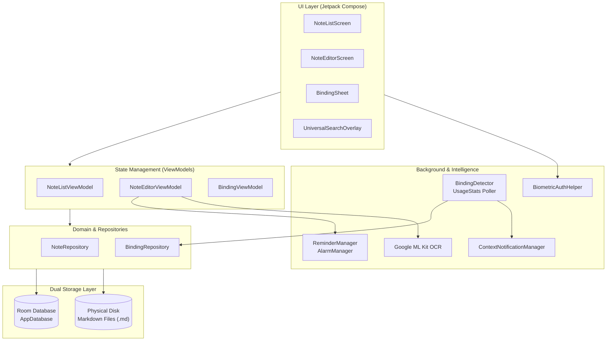

<div align="center">

# 📓 NAUGHTY

### *The Context-Aware, Local-First Markdown Workspace for Android.*

[-3DDC84?style=flat-square&logo=android&logoColor=white)](#)
[-34A853?style=flat-square&logo=android&logoColor=white)](#)
[](#)
[](#)
[](#)
[](#)
[](LICENSE)

<br/>

> **Most note apps trap your thoughts inside a silo.**  
> **Naughty surfaces them dynamically the exact moment and place you need them.**

<br/>

[Key Features](#-key-features) •
[Architecture](#-system-architecture) •
[Themes & Aesthetics](#-handcrafted-themes--paper-patterns) •
[Security & Privacy](#-security--privacy-first) •
[Privacy Policy](PRIVACY.md) •
[Security & Signing](SECURITY.md) •
[Building from Source](#-building-from-source)

---

</div>

<br/>

## 💡 Why Naughty?

Have you ever created a shopping list in your notes, only to forget checking it when you open your grocery app? Or jotted down meeting action items that you completely forgot to review when opening Zoom or Slack?

**Naughty solves context switching.** By pairing standard, future-proof Markdown notes with an on-device app-context detector, Naughty delivers actionable heads-up cards whenever you enter a designated workflow on your phone.

Your data remains **100% yours**: every note is saved as a physical `.md` file directly on device storage. No cloud logins, no tracking telemetry, no subscription paywalls.

---

## ⚡ Key Features

### 🧠 1. Context-Aware App Binding
Bind any note or checklist to one or multiple applications installed on your phone.
* **Smart Detection**: Battery-friendly background engine monitors foreground app transitions using Android's native `UsageStatsManager`.
* **Flexible Trigger Modes**:
  * **Persistent**: Surfaces your note whenever the target application opens.
  * **One-Shot**: Auto-deactivates after firing once (ideal for quick errands and one-time reminders).
  * **Custom Expiry**: Set specific date and time deadlines for bindings to retire automatically.
* **Non-Intrusive Notifications**: High-priority heads-up notification with instant deep-linking. Automatically dismisses when you navigate away from the target app.

### 📝 2. Dual-Mode Block & Raw Markdown Editor
A distraction-free writing environment that adapts to your preferred style:
* **Interactive Block Mode**: Checklists, headers, and paragraphs operate as intuitive tactile blocks. Pressing `Enter` on an empty checklist item seamlessly converts to standard text.
* **Raw Markdown Mode**: Full source markdown control with live formatting preview powered by Markwon.
* **Undo & Redo History**: Complete snapshot-based time travel across up to 30 editing states.
* **Debounced Auto-Save**: Changes asynchronously flush to physical disk `.md` files in real time.

### 🔔 3. Markdown-Native & Scheduled Reminders
* **Inline Task Reminders**: Embed reminders directly into task items using standardized markdown syntax: `[🔔 Pay bill](reminder:1743516000000)`.
* **AlarmManager Exact Alerts**: Reliable alarms scheduled with Android's `RTC_WAKEUP` exact alarm subsystem, resilient across phone reboots (`BOOT_COMPLETED`).
* **Calendar Sync**: One-tap action to mirror note reminders directly into your Google Calendar or device calendar provider.

### 🔒 4. Hardware-Backed Biometric Vault
* Protect sensitive notes behind **BiometricPrompt** (Fingerprint, 3D Face Unlock) with seamless fallback to your device PIN, pattern, or password.
* **Zero Leakage**: Note contents are masked with `"Locked note • Tap to unlock"` across card previews, universal search results, and notifications until authenticated.
* **In-Memory Session Security**: Unlocks are isolated to the active session and re-lock automatically upon application disposal.

### 👁️ 5. Local On-Device OCR (Text Recognition)
* Extract text from photos, documents, whiteboard captures, or receipts without internet access.
* Powered by Google ML Kit's local on-device text recognition model.
* Insert scanned text directly into your active note cursor or append it to blocks in one click.

### 🔍 6. Universal Search & Workspace Management
* **Instant Search**: Deep queries across titles, body markdown, and bound package names.
* **Quick-Jot Dock**: Capture fleeting thoughts or new checklist items in seconds from the persistent bottom dock.
* **Swipe Gestures**: Built with `AnchoredDraggable`—swipe left to **Archive**, swipe right to send to **Trash**.
* **Trash & Archive Management**: Dedicated recovery drawer to restore mistakenly deleted notes or permanently wipe your archive.

---

## 🎨 Handcrafted Themes & Paper Patterns

Naughty rejects sterile, generic interfaces in favor of intentional, rich typography and tactile notebook aesthetics.

### 14 Curated Aesthetic Themes
| Theme | Style | Palette Vibe |
| :--- | :--- | :--- |
| **Mononoke** | Dark | Monospace Emerald & Charcoal |
| **Gundam** | Light | Mecha Blueprint Grid & Royal Cobalt |
| **Tokyo Drift** | Dark | Cyberpunk Neon Cyan & Hot Magenta |
| **Vendetta** | Dark | Typewriter Noir & Crimson Accent |
| **Piccolo** | Light | Anime Mint Paper & Royal Violet |
| **A24** | Dark | Indie Cinema Slate & Amber Warmth |
| **Brave** | Light | Editorial Serif & Burnt Terracotta |
| **Agrabah** | Dark | Arabian Night Violet & Desert Gold |
| **Dracula** | Dark | Classic Dracula Slate, Pink & Mint |
| **Nord** | Dark | Arctic Frost Steel & Glacier Cyan |
| **Gruvbox** | Dark | Retro Warm Groove & Ochre |
| **Solarized** | Light | Classic Terminal Parchment & Cyan |
| **Dot Matrix** | Dark | 80s Phosphor CRT Green & Deep Pitch |
| **Flexoki** | Light | Minimal Inky Wove Paper & Forest Pine |

### Tactile Paper Patterns
Each theme features custom canvas-rendered paper backgrounds:
* 📐 **Blueprint & Technical Grid**
* 🔘 **Bullet Journal Dot Grid**
* 📝 **College-Ruled Notebook Lines**
* 📄 **Clean Textured Canvas**

---

## 🏗️ System Architecture

Naughty is engineered around modern Android architecture, eliminating bloated frameworks in favor of clean, performant Kotlin coroutines and Jetpack Compose primitives.



### Technology Stack
* **Language**: 100% Kotlin 2.3.20 (Java 17 target).
* **UI**: Jetpack Compose (BOM 2026.03.01) + Material Design 3.
* **Navigation**: AndroidX Navigation 3 (`navigation3-runtime`, `navigation3-ui`).
* **Database**: Room 2.8.4 SQLite ORM with KSP 2.3.12 code generation.
* **Markdown Parser**: Markwon 4.6.2 (Tables, Strikethrough, Custom Spans).
* **Settings**: Jetpack DataStore Preferences.
* **Machine Learning**: Google ML Kit Latin Text Recognition (offline bundled).
* **Security**: AndroidX Biometric 1.2.0-alpha05.

---

## 🛡️ Security & Privacy First

Naughty is built on an uncompromising privacy stance:
* **Zero Internet Permissions**: Naughty does not declare `android.permission.INTERNET` in its manifest. It is physically impossible for the app to send data to any remote server.
* **Zero Trackers or Analytics**: No Firebase Analytics, no Mixpanel, no Sentry, no crashlytics pinging external domains.
* **Local ML Recognition**: Image text recognition operates entirely on your device's CPU/NPU.
* **Open File Storage**: Notes are written directly into standard UTF-8 `.md` files. You can export or backup your notes anytime via the system share sheet.

### Transparency: Manifest Permissions
| Permission | Why It's Needed |
| :--- | :--- |
| `PACKAGE_USAGE_STATS` | Detects when you open an app bound to a note so Naughty can surface your contextual reminder. |
| `POST_NOTIFICATIONS` | Delivers contextual note cards and scheduled task alarm notifications. |
| `SCHEDULE_EXACT_ALARM` | Ensures alarms fire at the exact minute requested, even when the device is in Doze mode. |
| `USE_EXACT_ALARM` | Auto-granted exact alarm capability for reminder apps on Android 13+. |
| `RECEIVE_BOOT_COMPLETED`| Reschedules active alarms when your device powers back on. |
| `USE_BIOMETRIC` | Prompts for fingerprint or facial authentication to unlock secured notes. |

> [!NOTE]
> **Strict Offline & Package Privacy**:
> `android.permission.INTERNET` is explicitly stripped via `tools:node="remove"`. Furthermore, Naughty rejects high-risk `QUERY_ALL_PACKAGES` in favor of standard Android 11+ `<queries>` for launcher activities.

---

## 🔐 Release Signing & Verification

All official Naughty releases are cryptographically signed using Android APK Signature Schemes **v2** and **v3**.

* **Release Certificate Owner**: `CN=Naughty FOSS, OU=Release, O=Naughty Open Source, L=Local, ST=State, C=US`
* **Validity**: October 7, 2026 — February 22, 2054
* **SHA-256 Fingerprint**:  
  `7A:1C:0C:93:A9:93:D8:93:48:67:5C:C3:78:C7:57:8A:6C:BA:12:30:E7:2B:93:19:71:74:F4:66:36:7D:E9:FA`

Verify any downloaded release APK using `apksigner`:
```bash
apksigner verify --verbose --print-certs Naughty-v*-release.apk
```

---

## 📦 Installation & Getting Started

### Option A: Install Pre-built Release APK
1. Download the latest **`Naughty-v2.1.6-release.apk`** from the project root or GitHub Releases.
2. Transfer to your Android device (or download directly in your mobile browser).
3. Tap the file to install (grant "Install Unknown Apps" permission to your file manager if prompted).
4. Launch **Naughty** and start jotting!

### Option B: Install via ADB
```bash
adb install -r Naughty-v2.1.6-release.apk
```

---

## 🛠️ Building from Source

### Prerequisites
* macOS, Linux, or Windows with Android Studio installed.
* Android SDK (API 36, Build-Tools 36.0.0+).
* JDK 17 or higher (JetBrains Runtime / OpenJDK recommended).

### 1. Clone the Repository
```bash
git clone https://github.com/priteshranjan/Naughty.git
cd Naughty
```

### 2. Configure Environment
Set `JAVA_HOME` and `ANDROID_HOME` in your environment (e.g. `~/.zshrc` or `~/.bashrc`):
```bash
export JAVA_HOME="/Applications/Android Studio.app/Contents/jbr/Contents/Home"
export ANDROID_HOME="$HOME/Library/Android/sdk"
export PATH="$ANDROID_HOME/platform-tools:$PATH"
```

### 3. Run Automated Tests
```bash
export JAVA_HOME="/Applications/Android Studio.app/Contents/jbr/Contents/Home"
./gradlew testDebugUnitTest
```

### 4. Build Debug APK
```bash
export JAVA_HOME="/Applications/Android Studio.app/Contents/jbr/Contents/Home"
./gradlew assembleDebug
```
Output: `app/build/outputs/apk/debug/app-debug.apk`

### 5. Automated Release Build Script
Naughty includes a production build script that handles testing, compiling, cryptographic signing verification, and packaging:
```bash
# Build signed release APK (FOSS) and signed AAB bundle (Google Play)
./build_release.sh

# Bump version and build
./build_release.sh --bump

# Build and automatically install onto connected device
./build_release.sh --install
```
Outputs:
* `Naughty-v<VERSION>-release.apk` (Signed APK for FOSS distribution)
* `Naughty-v<VERSION>-release.aab` (Signed Android App Bundle for Google Play Store)

---

## 🤝 Contributing

Contributions are welcomed! Whether you are designing new color themes, enhancing Markdown rendering capabilities, or refining contextual trigger heuristics:

1. Fork the Project.
2. Create your Feature Branch (`git checkout -b feature/AmazingFeature`).
3. Ensure unit tests pass (`./gradlew testDebugUnitTest`).
4. Commit your Changes (`git commit -m 'feat: Add AmazingFeature'`).
5. Push to the Branch (`git push origin feature/AmazingFeature`).
6. Open a Pull Request.

---

## 📄 License

Distributed under the **MIT License**. See [`LICENSE`](LICENSE) for more information.

<br/>

<div align="center">

Crafted with care for thinkers, builders, and privacy purists.  
**Naughty** — *Notes that know when to show up.*

</div>
